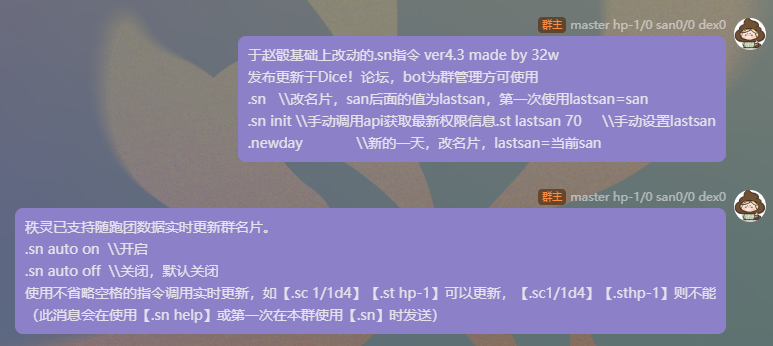
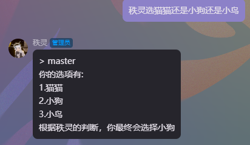
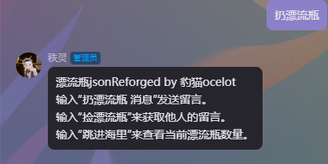
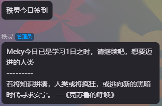
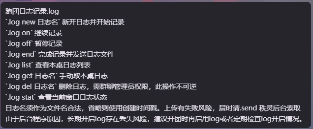

这里是秩灵的使用手册！
========================

| 由于秩灵为溯洄骰，在这放上一些资料
| 秩灵：2083497680

| shiki&溯洄系手册: `shiki&溯洄系骰娘的搭建答疑指南 <https://jcnb1taoolhj.feishu.cn/docx/UupHdhLa7o1NkzxoRGacSHlinae>`_
| Dice论坛: `https://forum.kokona.tech/ <https://forum.kokona.tech/>`_
| Dice官群: 928626681（云黑播报群） 1029435374（交流反馈群）

骰主
**********

骰主是狗鸟Dogbird！联系方式放在上一页了，不过担心有人不会去，我在这也放一个

| QQ：2838407585
| vx：DbirdMons1617qz
| 提一嘴，能加QQ就全去QQ，vx不一定加得上
| 邮箱：darksea_dogbird@qq.com

| 给你们看看美丽骰主（和秩灵长得很像，世界观原因）

必看项！！！！！！！！！
*********************
.. note::

   这里是必须看的必须看的必须看的！（说三遍）要是因为没看这个而被拉黑，我不会给予解黑资格！具体可以询问骰主

1. 禁止将秩灵拉入非跑团群！！！要是实在想要请找骰主申请！要是拉入，秩灵会自行退群，但是要是刷指令，秩灵将会拉黑邀请者与群主！
2. 秩灵决不允许集骰行为！要是发现，处理方式同1
3. 请秩灵出群请使用.dismiss(记得，不是.dissmiss)，不可踢，解散群聊前也尽量先请出秩灵，要是秩灵不在线（被tx制裁或者没开），请联系骰主退群
4. 禁言秩灵也会被拉黑！正确用法应为.bot off + .reply off
5. 禁止做诋毁骰娘的事，经发现将被警告或者拉黑！
6. *刷屏在程序内定义为发送指令超过20/30s，实际解释权归Master所有*

基本使用指令
**********
| 详细请查看 `用户手册 <https://v2docs.kokona.tech/zh/latest/User_Manual.html#>`_
| 这里放几个基本的指令

.. note::

   | .sn和常见豹骰那些是不一样的，直接发送.sn即可，后续会持续更新保持指令一致
   | .reply off才能关闭自定义回复，bot off是关不上的

- ``.r``  --最基础的骰点
- ``.rap`` --惩罚骰
- ``.rab``  --奖励骰
- ``.help``  --查看帮助(strHlpMsg)
- ``.help [词条名]``  -- 查看对应帮助文档
- ``.bot on/off``  --开关秩灵
- ``.bot``  --查看版本信息
- ``.reply on/off``  --启动禁用回复
- ``.send``  --向后台发送消息
- ``.set``  --设置默认骰
- ``.coc``  --coc人物作成，俗称天命，天命五的意思就是.coc5
- ``.dnd``  --dnd人物作成
- ``.ra/.ra``  --检定
- ``.setcoc``  --设置rc房规
- ``.sc``  --理智检定
- ``.en``  --成长/增强检定
- ``.welcome``  --入群欢迎
- ``.jrrp``  --今日人品
- ``.name``  --随机昵称(cn/en/jp)
- ``.nn``  --设置称呼
- ``.ri``  --先攻
- ``.dismiss``  --请秩灵出群
.. DANGER::
   请注意，把秩灵踢出群会被拉黑，要解散群聊之前也请把秩灵提前使用.dismiss请出

- ``.draw``  --抽牌，点击待定查看装载牌堆
- ``log``  --log操作，由于有修改，请发送 ``.log`` 来查看

录卡
++++++
| 鉴于很多萌新不会，我就提一嘴
| 先.pc new 名称，再.st录入，最后.sn，有卡换群直接.pc tag 名称后.sn就行啦

group群管指令
+++++++++++
- ``.group state``   --查看在群内对骰娘的设置
- ``.group pause/restart``   --群全体禁言/全体解除禁言
- ``.group card [at/用户ID] [名片]``   --设置群员名片
- ``.group title [at/用户ID] [头衔]``   --设置群员头衔
- ``.group diver   --查看潜水成员``
- ``.group +/-[群管词条]``   --为群加减设置，需要对应权限
- ``例:.group +禁用回复``   --关闭本群自定义回复
群管词条:停用指令/禁用回复/禁用jrrp/禁用draw/禁用me/禁用help/许可使用/免清/免黑

game（游戏模式）
+++++++++++++
| 不是team哦，溯洄有自己的game
- ``.game new 桌名`` --创建游戏（桌名可省略，前缀以`规则-`可以指定应用规则）
| 例: .game new DND
| 创建者自动视为GM
- ``.game over``  --销毁本桌游戏
- ``.game state``  --查看本桌状态
- ``.game master``  --登记为GM
- ``.game set 属性=值`` 游戏设置
| 例: .game set rule=COC7
- ``.game set 属性``  --查看设置
- ``.game call``  --at玩家
- ``.game join``  --玩家登记
- ``.game kick 玩家ID``  --将玩家踢出游戏
- ``.game exit``  --退出游戏
- ``.game open 桌号``  --将当前窗口加入指定游戏
- ``.game close``  --关闭当前游戏
- ``.game rou 100``  --设置(百面)轮盘骰，详见.help roulette

role（规则设置/查询）
+++++++++++++++++
- ``.rule set [规则]`` 或 ``.rules ([规则]):[待查词条]``
- ``.ruleset dnd``  --设置房间规则书
- ``.rules 跳跃``  --优先检索房间规则书，否则复数规则有相同词条时，择一返回
- ``.rules COC:大失败``  --coc默认搜寻coc7的词条,dnd默认搜寻3r
- ``.rules dnd:语言``

ob（旁观模式）
+++++++++++
| .ob (join/exit/list/clr/on/off)
- ``.ob join``  --加入旁观，可以看到本桌暗骰结果
- ``.ob exit``  --退出旁观模式
- ``.ob list``  --查看本桌旁观者
- ``.ob clr``  --清除所有旁观者
- ``.ob on/off``  --本桌开/关旁观模式
| 暗骰与旁观私聊无效

st（属性记录）
+++++++++++
| .st (del/clr/show) ([属性名]:[属性值])
| pl默认所有群使用同一张卡，如需多开请使用.pc指令切卡
- ``.st 力量:50 体质:55 体型:65 敏捷:45 外貌:70 智力:75 意志:35 教育:65 幸运:75``
- ``.st hp-1`` 后接+/-时视为从原值上变化
- ``.st san+1d6`` 修改属性时可使用掷骰表达式
- ``.st del kp裁决``  --删除已保存的属性
- ``.st clr``  --清空当前卡
- ``.st show 灵感``  --查看指定属性，无参数时查看所有属性
| 部分属性会被视为同义词，如理智/san、侦查/侦察
| 若.st后属性未发生变化也会返回本词条
| 一般来说属性出错的时候去st看一眼，简化卡有时会抽风

pc（角色卡）
++++++++++
- ``pc new (模板:(生成参数:))(卡名)
| 例: `.pc new 卡特`  --完全省略参数将生成一张COC7模板的随机姓名卡
- ``pc tag (卡名)``  --为当前群绑定指定卡，为空则解绑使用默认卡
| 所有群默认使用私聊绑定卡，未绑定则使用0号卡
- ``pc show (卡名)``  --展示指定卡所有记录的属性，为空则展示当前卡
- ``pc nn 新卡名``  --重命名当前卡，不允许重名
- ``pc type 模板``  --将切换当前卡模板
- ``pc cpy 卡名1=卡名2``  --将后者属性复制给前者
- ``pc del 卡名``  --删除指定卡
- ``pc list``  --列出全部角色卡
- ``pc grp``  --列出各群绑定卡
- ``pc build (生成参数:)(卡名)``  --根据模板填充生成属性（COC7为9项主属性）
- ``pc stat``  --查看当前角色卡骰点统计
- ``pc redo (生成参数:)(卡名)``  --清空原有属性后重新生成
- ``pc clr``  --销毁全部角色卡记录
| 掷骰统计以角色卡为单位，每名用户最多可同时保存32张角色卡

init（先攻列表）
+++++++++++++
- ``.init list``  --查看先攻列表
- ``.init clr``	  --清除先攻列表
- ``.init del [项目名]``   --从先攻列表移除项目

sn（实时更新群名片）
++++++++++++++++
| 我懒了，直接放图吧

装载牌堆
*******
| 目前秩灵装载牌堆有:
- coc的一百零一种导入方式： ``coc导入``
- 克苏鲁神话： ``克苏鲁神话``
| （骰主找了好久好久好久）
- 咖啡~： ``咖啡点单``
- 答案之书： ``答案之书``

拓展指令
*******
| 这里是秩灵有装进去的插件，会不断更新，想要这些插件可以找骰主要，正常来说都会是骰主自己写的，（漂流瓶除外但也快了）
| 很少，但是骰主不会把秩灵写成娱乐骰娘的所以娱乐功能不会多

Choose
++++++
| 这是骰主自己写的但是有借鉴
| 指令： ``选择...还是...还是......`` 理论上可以无限多

| **请不要用其刷屏！**

漂流瓶
+++++

| 原创版再写了在写了，可以在这丢下跑团经历啊，说不定能找到心有灵犀的人

每日签到
+++++++
| 骰主不喜欢好感度系统而且对秩灵来说这也挺ooc的，所以签到只是普通的记录天数和抽取，内容来自克苏鲁神话

log
+++

| 添加了log的插件加入了溯洄没有的log操作

赞助一下
*********
| 看在骰主这么努力了的份上，赞助一下呗

